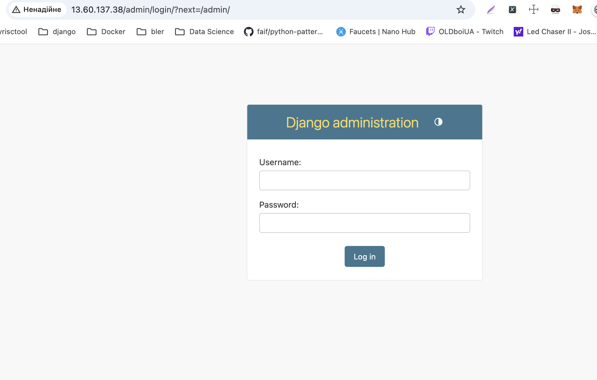
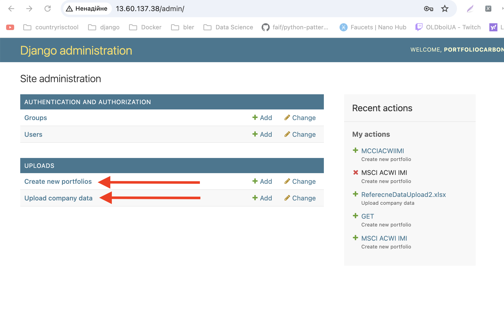
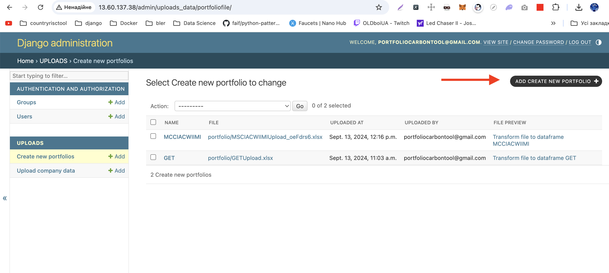
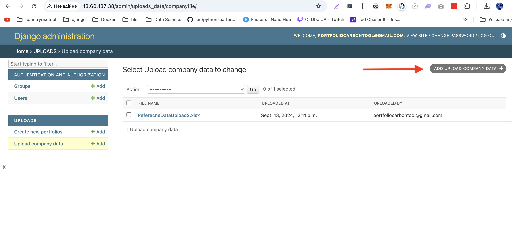
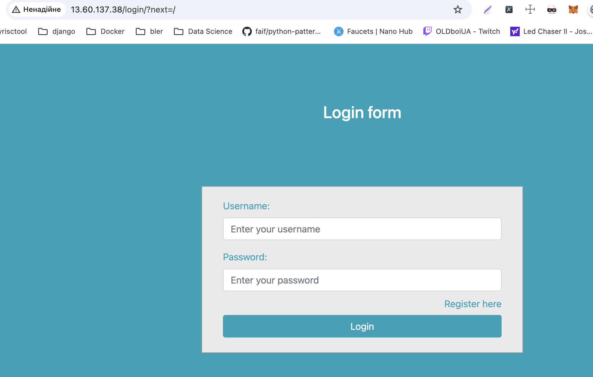
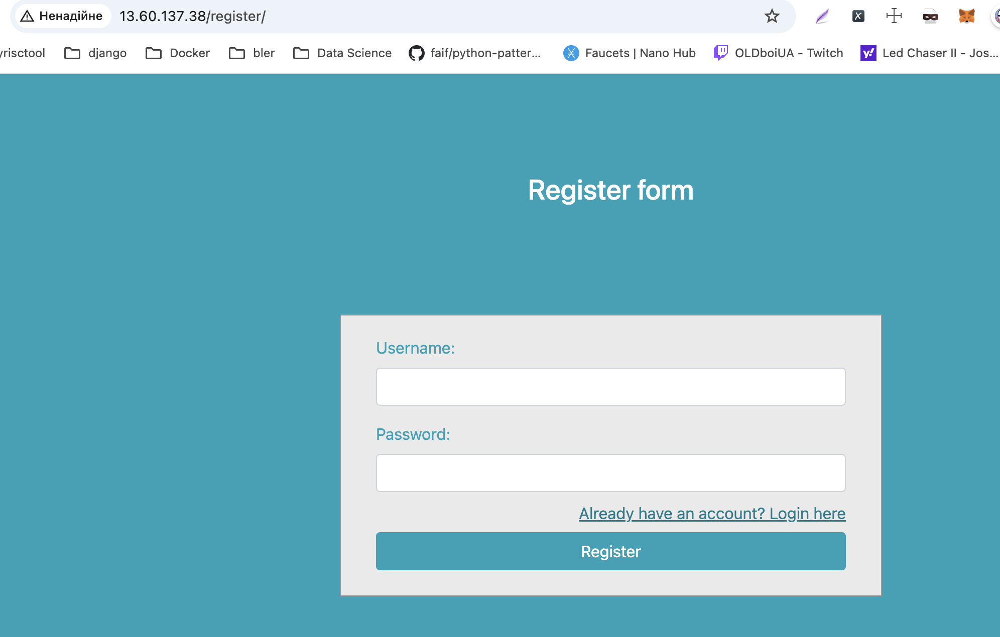
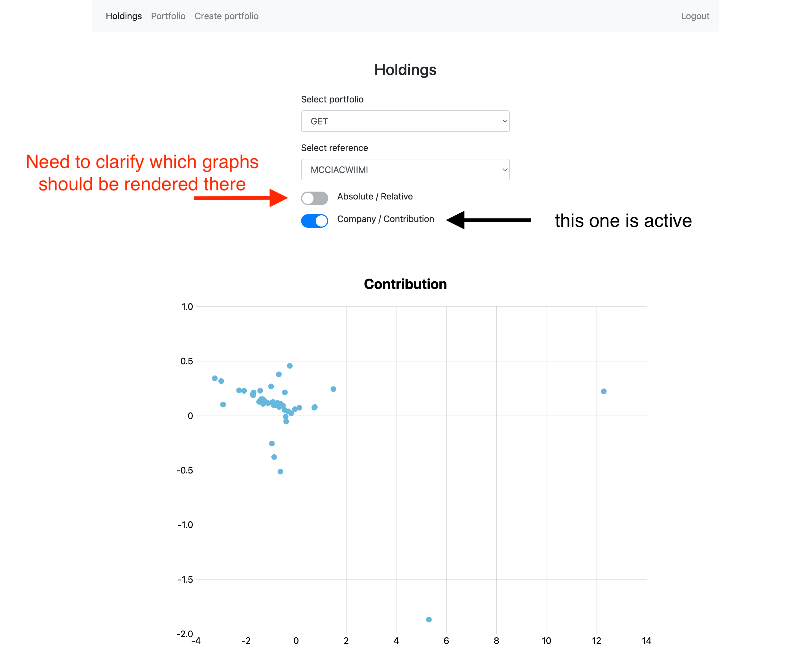

#  Usage instructions

## Curently site deployed on http://13.60.137.38/ AWS Instance type t3.medium

### admin section

url: http://13.60.137.38/admin/login/?next=/admin/

After login admin can provide the actions for uplad the data

There is the instruction for add porfolio

There admin can upload companies data

Examples files to admin upload
[example portfolio file](./test_upload_data/GETUpload.xlsx)

[example company data file](./test_upload_data/ReferenceDataUpload.xlsx)

### user interface 

http://13.60.137.38/login/

http://13.60.137.38/register/

http://13.60.137.38/

